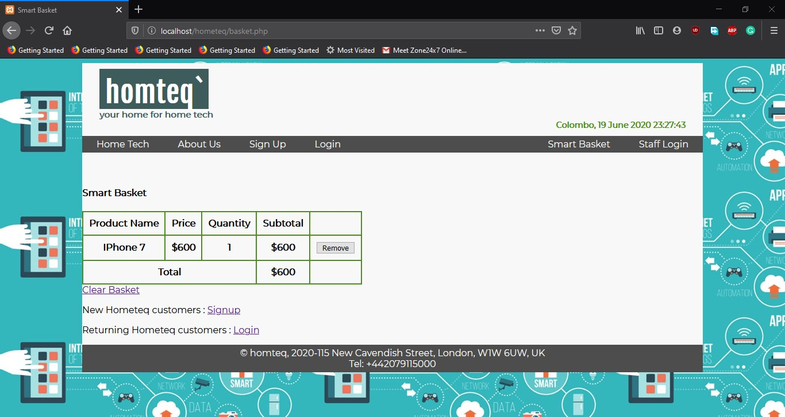
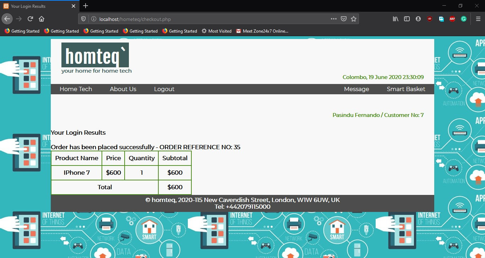
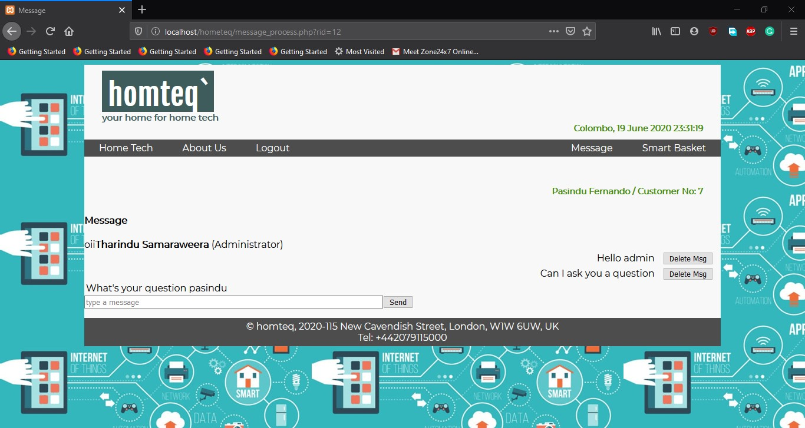
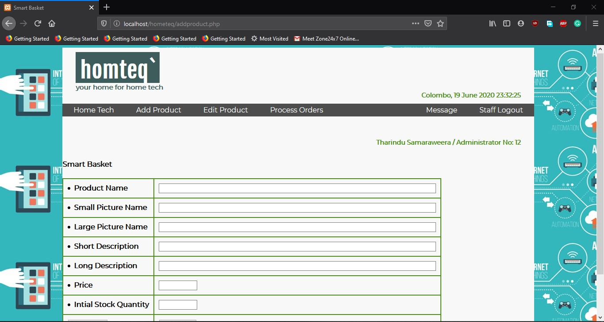

# Hometeq
Landing page with search function

 
 
Once we click an item it will show mode details of the item , price & quantity 
from this page user can add the item to the basket

 
 
Once the user clicks "add to basket" on details paged user will be directed to this page
 in this page user can view and delete items in the basket. if user wants to order an
 item user needs to signup or login

 

 

 

 

 

 

 

