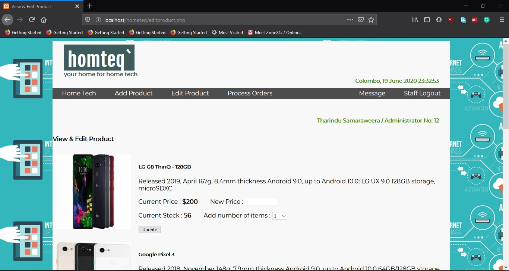

# Hometeq
Landing page with search function

 
 
Once we click an item it will show mode details of the item , price & quantity 
from this page user can add the item to the basket

 
 
Once the user clicks "add to basket" on details paged user will be directed to this page
 in this page user can view and delete items in the basket. if user wants to order an
 item user needs to signup or login

 

 
 
After user logged in the name will be displayed on the right top corner and user can placethe order

 
 
Once user logged in user will get a function to message. This window shows all registered users and
 administrators

 
 
User can send messages and delete messages too send messages showed in right side and received messages
 are showed in left side user can only deleted the messages user sent 

 
 
Once we logged in as an Administrator we will get the privilage to add,edit products and manage orders
 this windows shows a form once administrator enters a new product to this form it will be added to
 the my-sql database

 
 
This shows the Edit product tab which can only accessed by the administrator. Administrator can edit the 
 price and the quantity of the product

 
 
This shows the Process Order tab which also can only be accessed by the administrator. Administrator can 
 change the status of the order to "Collected" , "Ready to Collect" or "Placed".

